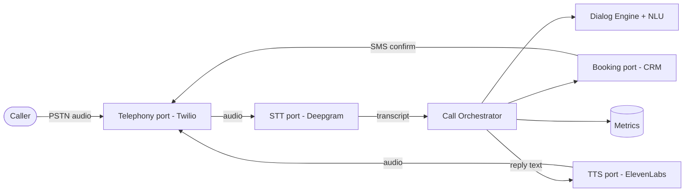
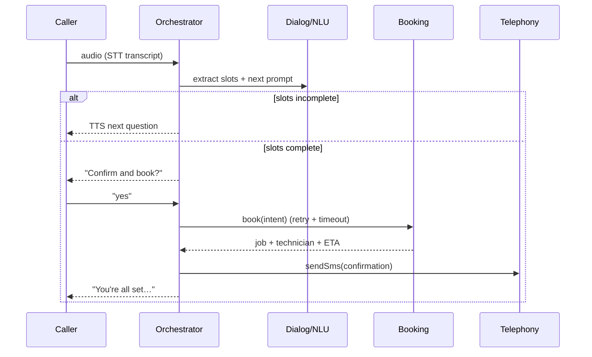

# VoiceForge

> Production-grade **voice AI agent** that answers inbound phone calls, collects a
> service request through natural turn-taking, books the job, and texts a
> confirmation — the voice front door for a home-services business.


VoiceForge models the **Twilio → Deepgram (STT) → LLM/dialog agent → ElevenLabs (TTS)**
telephony pipeline behind clean ports, so the entire conversation flow runs and is
tested **offline with deterministic mocks**, and swaps to real vendors purely through
configuration.

## Table of contents

- [Why](#why)
- [Architecture](#architecture)
- [Call flow](#call-flow)
- [Components](#components)
- [Running it](#running-it)
- [HTTP API](#http-api)
- [Resilience & observability](#resilience--observability)
- [Complexity](#complexity)
- [Testing](#testing)
- [Engineering guideline coverage](#engineering-guideline-coverage)

## Why

Home-service front offices miss calls, and every missed call is a lost job. VoiceForge is
an always-on voice agent that qualifies the caller, fills the six slots needed to dispatch
(name, phone, address, trade, urgency, description), confirms, books into the CRM, and
sends an SMS — escalating to a human when it cannot help.

## Architecture



Every arrow that crosses a network boundary is an **interface** (`SttPort`, `TtsPort`,
`TelephonyPort`, `BookingPort`, `NluPort`). The orchestrator depends only on those
interfaces — never on a vendor SDK — which is what makes the whole pipeline unit-testable.

## Call flow



State machine: `ringing → greeting → collecting → confirming → booking → completed`,
with `escalated`/`failed` fallbacks. Illegal transitions throw a typed
`InvalidCallStateError` — an unrepresentable state cannot become a silent bug.

## Components

| Module | Responsibility |
|---|---|
| `domain.ts` | `CallSession` aggregate + explicit state machine, slots, `BookingIntent` |
| `providers.ts` | `SttPort` / `TtsPort` / `TelephonyPort` + deterministic mocks + live seams |
| `dialog.ts` | `NluPort` (rule-based slot extraction) + `DialogEngine` prompt planner |
| `booking.ts` | `BookingPort` + in-memory technician-matching engine |
| `orchestrator.ts` | Turn-taking loop, barge-in detection, confirm/book, escalation |
| `reliability.ts` | `withTimeout` + `withRetry` (exponential backoff, full jitter) |
| `metrics.ts` | Dependency-free Prometheus registry (counters + latency histograms) |
| `server.ts` | Hono HTTP surface for calls and turns |

## Running it

```bash
pnpm install
pnpm test          # 41 tests
pnpm dev           # http://localhost:4100  (mock providers, no network)

# one full booking call:
CID=$(curl -s -XPOST localhost:4100/calls | jq -r .callId)
for u in "my name is Maria Lopez" "call me on 555 246 8100" \
         "I'm at 88 Willow Lane" "my AC stopped working" \
         "it is an emergency" "yes please book it"; do
  curl -s -XPOST localhost:4100/calls/$CID/turn \
       -H 'content-type: application/json' -d "{\"text\":\"$u\"}" | jq -r .agentText
done
```

Docker: `docker compose up --build` (add `--profile monitoring` for Prometheus + Grafana).

## HTTP API

| Method | Path | Purpose |
|---|---|---|
| `POST` | `/calls` | Start a call; returns the greeting and `callId` |
| `POST` | `/calls/:id/turn` | Submit the caller's transcribed text; returns the agent reply |
| `GET` | `/calls/:id` | Call snapshot (status, slots, transcript, job id) |
| `GET` | `/health` | Liveness |
| `GET` | `/metrics` | Prometheus exposition |

## Resilience & observability

- **Timeouts** bound every STT/TTS/booking call (`TURN_TIMEOUT_MS`) so a slow vendor
  can never stall a live phone call.
- **Retry with backoff + full jitter** wraps the booking call; only `retryable` typed
  errors are retried.
- **Escalation**: after `MAX_TURNS` the agent hands off to a human.
- **Barge-in** detection cancels agent speech when the caller talks over it.
- **Metrics**: `voiceforge_turn_latency_ms`, `voiceforge_stt_latency_ms`,
  `voiceforge_tts_latency_ms`, `voiceforge_calls_total{outcome}`,
  `voiceforge_bookings_total{result}`, `voiceforge_bargein_total`. Alert rules in
  [`monitoring/alerts.yml`](monitoring/alerts.yml).

## Complexity

| Operation | Time | Notes |
|---|---|---|
| Slot extraction per turn | O(k) | k = keyword set, constant |
| Next-prompt planning | O(1) | first missing slot |
| Booking (technician match) | O(t) | t = technicians |
| Metrics exposition | O(m) | m = series |

## Testing

```
 ✓ src/domain.test.ts        (7)
 ✓ src/dialog.test.ts        (11)
 ✓ src/providers.test.ts     (7)
 ✓ src/reliability.test.ts   (6)
 ✓ src/orchestrator.test.ts  (5)   full happy path, negative confirm, booking failure,
                                    escalation, barge-in
 ✓ src/server.test.ts        (5)   end-to-end HTTP booking call
 Test Files  6 passed (6)
      Tests  41 passed (41)     coverage 94.85% stmts / 94.58% branch
```

## Engineering guideline coverage

| Guideline | Where |
|---|---|
| SOLID / hexagonal ports | `providers.ts`, `booking.ts`, `dialog.ts` interfaces |
| Type-safety (make illegal states unrepresentable) | `CallSession` state machine, `BookingIntent` |
| Timeouts / retry / fault tolerance | `reliability.ts`, `orchestrator.performBooking` |
| Error handling | typed `VoiceForgeError` hierarchy with `retryable` |
| Generics | `Result`-free typed flow, generic `withRetry<T>` / `withTimeout<T>` |
| Observability | `metrics.ts`, structured Pino logging, alert rules |
| GraphQL vs REST | REST chosen — 5 endpoints, below the >5 GraphQL threshold |
| Agentic AI | dialog/NLU seam, swappable for an LLM extractor behind `NluPort` |
| Testing (≥85%) | 41 tests, 94% coverage |
| Docker / CI | multi-stage `Dockerfile`, `.github/workflows/ci.yml` |
| Postman | `postman/VoiceForge.postman_collection.json` |